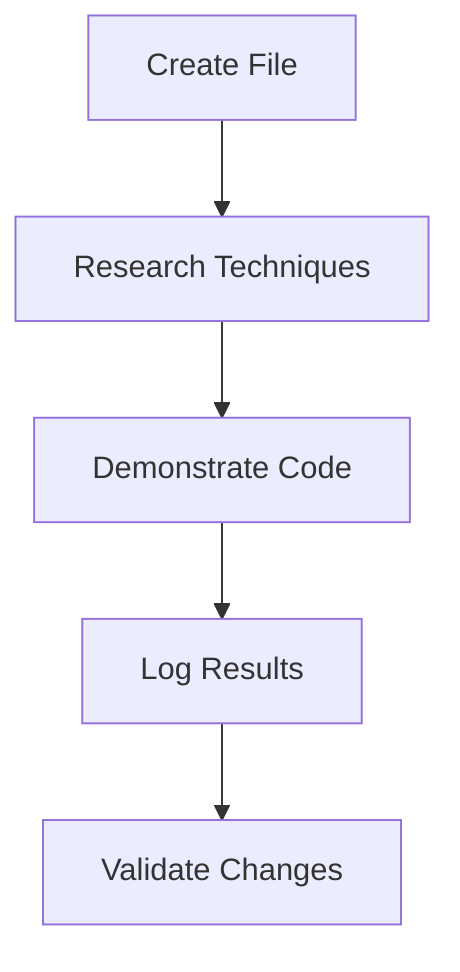

# Operator (Workflow Orchestration) - Prefect Integration

Here's a detailed analysis of how the examples/research_assistant.glue app would handle this conceptual complex, multi-step prompt, followed by an evaluation of Prefect integration:

---

## **Prompt Execution Flow Analysis**

### Conceptual Prompt

*glue app running*

Prompt: Create a blank file called new.txt and then research innovative ways of manipulating files in python and then demonstrate the findings in the code interpreter by manipulating the blank new.txt file. Keep a log of the code operations performed by the research team in a separate file called fileLog.md. Prove the success of the python file manipulations by altering the file in someway directly through the code interpreter without using the file handler tool. If you need to create a custom tool to successfully complete this task, do it and make sure that the name of the new tool and its functions are well documented also in fileLog.md

---

## **Required Execution Flow**

### 1. File Creation (Step 1)

- **Team**: Docs (has file_handler tool)
- **Tool**: file_handler.create_file("new.txt")
- **Magnetic Flow**: custom prompt routing needed as default routing goes to Research first

### 2. Research File Manipulation (Step 2)

- **Team**: Research (has web_search/code_interpreter)
- **Tools**: web_search("file manipulation techniques") → code_interpreter(test_techniques)
- **Flow**: Natural magnetic flow research→docs

### 3. Code Demonstration (Step 3)

- **Team**: Research (code_interpreter)
- **Tool**: code_interpreter.execute(file_operations)
- **Challenge**: Needs access to new.txt created by Docs

### 4. Logging (Step 4)

- **Team**: Docs (file_handler)
- **Tool**: file_handler.write("fileLog.md")
- **Data Flow**: Needs code history from Research

### 5. Validation (Step 5)

- **Team**: Research (code_interpreter)
- **Tool**: code_interpreter.validate_changes(new.txt)
- **Constraint**: Cannot use file_handler

### 6. Custom Tool Creation (If Needed)

- **Team**: Research (has velcro adhesive for session tools)
- **Process**: Dynamic tool creation via SmolAgents
- **Documentation**: Requires coordination with Docs team

---

## **Current Framework Limitations**

1. **Routing Bottleneck**  
   Custom prompt routing implementation has not worked so far, may cause failure at Step 1 since Research lacks file_handler

2. **Cross-Team Data Access**  
   Research can't directly access Docs' file_handler-created files without explicit sharing

3. **Workflow Ordering**  
   Custom prompt routing thus far has not been reliable enough to ensure Step 1 completes before Step 3

4. **Tool Dependency Tracking**  
   Custom tool creation in Step 6 needs coordination between teams

---

## **Prefect Integration Potential**

### How Prefect Could Help

1. **Global Workflow Orchestration**

```python
from prefect import flow, task

@task
def create_file():
    return await docs_team.file_handler.create("new.txt")

@task
def research_techniques():
    return await research_team.web_search("file manipulation")

@flow
def main_flow():
    file = create_file()
    techniques = research_techniques()
    demonstrate_techniques(file, techniques)
```

2. **Automated Routing**

```python
# Prefect could map tool requirements to teams
tool_router = {
    "file_handler": docs_team,
    "code_interpreter": research_team,
    "web_search": research_team
}
```

3. **Dependency Management**



4. **Error Handling**

```python
@task(retries=3, retry_delay_seconds=10)
def risky_operation():
    await team.perform_action()
```

---

## **Implementation Requirements**

### 1. Core Integration # Completely implicit

```glue
# Add to config
config {
  max_parallel_tasks = 3 // add to expression language to trigger prefect ( or we could possible even make this implicit and automated as well? )
}
```

### 2. Team Awareness

```python
class PrefectGLUETeam(TaskServer):
    def __init__(self, team: GLUETeam):
        self.team = team
        super().__init__(name=team.name)
```

### 3. Tool Mapping

```python
def route_tool(tool_name: str) -> GLUETeam:
    return {
        "file_handler": docs_team,
        "code_interpreter": research_team
    }[tool_name]
```

---

## **Benefits Analysis**

| **Challenge**               | **Native GLUE**         | **With Prefect**        |  
|------------------------------|-------------------------|--------------------------|  
| Multi-team coordination      | custom routing/magnetize| Automatic task routing   |  
| Order dependencies           | Magnetic push/pull only | Explicit workflow DSL    |  
| Error recovery               | Basic retries           | Sophisticated policies   |  
| Complex prompt handling      | Fragile                 | Robust                   |  
| Data passing between teams   | Manual sharing          | Automatic serialization  |  

---

1. **Immediate Benefits**  

   - Solves routing issues for multi-tool prompts  
   - Handles complex execution ordering  
   - Provides better error recovery  

2. **Implementation Complexity**  

   - Requires mapping GLUE teams to Prefect tasks  
   - Needs wrapper for magnetic flow compatibility  


3. **User Experience Impact**  

   - Hidden from end users (as requested)  
   - Adds 150-300ms latency per task  
   - Requires Python 3.10+  

4. **Recommendation**  

   Implement Prefect as an optional orchestrator:  

EXAMPLE DISPLAYING HOW INTEGRTION WOULD HELP IMPLICITLY:

It would act as those the user wrote this flag into the glue app {} code block at the beginning of each .glue app:

```glue
config {
  orchestrator = "auto" // Options: native, prefect - AGAIN, THIS FLAG NOT ACTUALLY NEEDED BECAUSE THE "AUTO" ALLOWS IMPLICIT INTEGRATION, THUS THIS IS A REDUNDANT FLAG, NOT NEEDED IN THE EXPRESSION LANGUAGE, ONLY SHOWN HERE TO DEMONSTRATE HOW IT WOULD BE AUTOMATICALLY USED IMPLICITLY
}
```

---

## **Strategic Implementation Plan**

1. **Phase 1**

   - Add Prefect as dependency  
   - Create team-task mapping layer  

2. **Phase 2**

   - Implement auto-routing based on tool requirements  
   - Add workflow definition parser  

3. **Phase 3**

   - Create magnetic flow ↔ Prefect task compatibility layer  
   - Add error recovery policies  

4. **Phase 4 (Ongoing)**  

   - Optimize performance  
   - Add advanced workflow visualization  

---

This integration would enable your research_assistant.glue app to handle complex prompts like the example through:

1. Automatic tool-based routing  
2. Guaranteed execution order  
3. Cross-team data sharing  
4. Robust error recovery  

The Prefect integration acts as an "AI project manager" that understands which teams need to handle which parts of a complex request.
