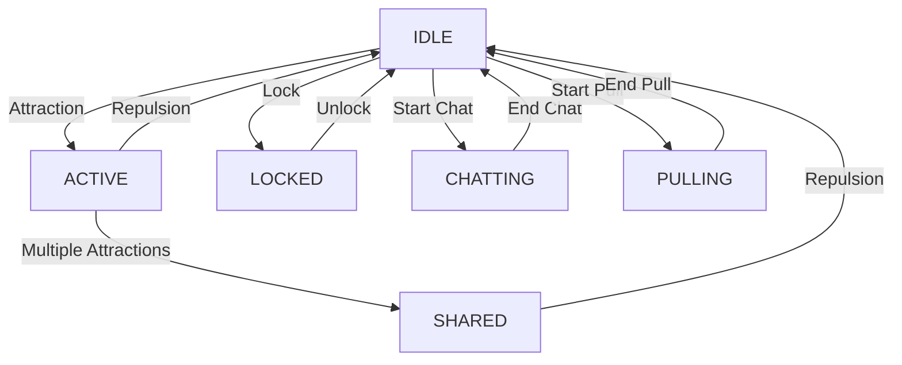

# Magnetic Patterns in GLUE

## Directional Magnetic Fields

### Flow Operators
- `><` : Bidirectional attraction (can use and receive)
- `<-` : Unidirectional flow (can only receive from)
- `<>` : Repulsion (cannot interact)
- `<-->` : Double Direct (Exclusively used for Conversational interaction between models)

### Example Workflow
```glue
workflow {
    researcher <--> writer # researcher and the writer can (only) chat between each other, they cannot share tools unless defined in the attract and repel config below

    attract {
        researcher >< web_search  # researcher can receive and send web_search queries 
        writer <- web_search # Writer can receive from but not use web_search 
        writer >< file_handler # Writer can use and receive from file_handler
    }
    repel {
        researcher <> file_handler # Researcher cannot use file_handler
    }
}
```

## Context-Aware Behaviors

### Interaction States
1. Direct Chat (CHATTING, "<-->")
   - No tool usage
   - Direct model responses
   - Conversational context

2. Research Mode (ACTIVE)
   - Researcher uses web_search
   - Results flow to writer
   - Writer creates/updates files

3. File Operations (ACTIVE)
   - Writer handles file operations
   - Based on conversation context
   - Maintains file history

4. Collaborative Mode (SHARED)
   - Models work together
   - Share context and memory
   - Coordinate responses

5. Pulling Mode (PULLING, "<-")
   - One-way data flow between resources
   - Receiving resource in PULLING state

6. Locked Mode (LOCKED)
   - Resource locked for exclusive use
   - Other resources cannot interact

### State Transitions


## Magnetic Resource Sharing

### Resource Types
1. Tool Results
   - Search results
   - File contents
   - Operation status

2. Conversation Context
   - Chat history
   - User preferences
   - Current topic

3. Shared Memory
   - File operations
   - Search history
   - Model interactions

### Flow Control
```glue
# Example resource flow configuration
resources {
    web_search {
        researcher >< web_search   # Researcher can send and receive queries
        writer <- web_search    # Writer can only receive results
    }
    
    file_handler {
        writer >< file_handler    # Writer has full access
        researcher <- file_handler # Researcher can see file status
    }
}

# Example resource flow config 2
resources {
    web_search {
        researcher >< web_search #researcher can send and recieve queries
        writer <- web_search # writer can only recieve results
    }

    file_handler {
        researcher <> file_handler # researcher cannot send or recieve from file handler
        writer >< file_handler # writer can send and recieve from file handler
    }
}
```

## Implementation Guidelines

### 1. Context Awareness
- Track conversation state using ContextState
- Monitor tool usage patterns
- Maintain interaction history
- Adapt model behaviors based on context

### 2. Workflow Management
- Implicit tool selection based on context
- Natural state transitions using update_state method
- Contextual role switching
- Resource flow control using attract and repel methods

### 3. Model Collaboration
- Share relevant context through ContextState
- Coordinate responses using ChatEvent
- Maintain conversation flow with CHATTING state
- Handle state transitions with update_state method

### 4. Memory Management
- Track file operations
- Store search history
- Remember user preferences in ContextState
- Share relevant context between resources

## Example Scenarios

### 1. Basic Research Flow
```glue
# User: "Look up the history of paperclips"
workflow {
    researcher >< web_search -> writer  # Research flow
    writer >< file_handler             # File creation
}
```

### 2. File Modification
```glue
# User: "Add sources to that file"
workflow {
    writer >< file_handler   # Direct file operation
    writer <--> researcher     # Context sharing
}
```

### 3. Mixed Interaction
```glue
# User: "Search but don't save, just tell me"
workflow {
    researcher >< web_search  # Direct research
    researcher <--> user        # Direct response
}
```

## Future Considerations

### 1. Autonomous Collaboration
- Models decide workflow
- Self-organizing chains
- Dynamic role adjustment
- Adaptive tool usage

### 2. Learning Patterns
- Track successful flows
- Adapt to user preferences
- Optimize tool chains
- Improve context awareness

### 3. Enhanced Context
- Multi-session memory
- Cross-model learning
- Workflow optimization
- Resource efficiency

### 4. Advanced State Management
- Implement more granular state transitions
- Develop strategies for handling complex multi-resource interactions
- Explore potential for new resource states based on emerging use cases
